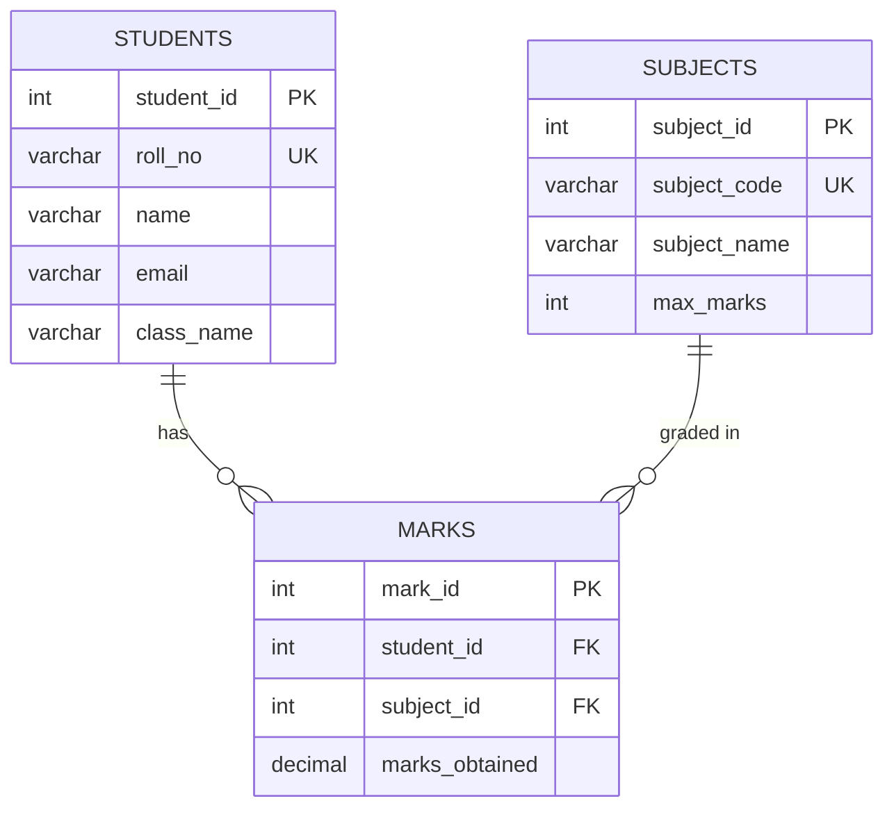

<div align="center">

# 🎓 Student Result Management System

**A clean, console-based Java + MySQL application to manage students, subjects, marks, and generate term report cards.**


</div>

---

## 📖 About the Project

Schools and colleges often track results on paper or scattered spreadsheets, which makes updates slow and error-prone.
**Student Result Management System (SRMS)** solves this with a simple Java application backed by a **normalized MySQL database**.
You can add students and subjects, enter marks, and instantly generate a formatted **report card** with percentage, grade and pass/fail status for a full academic term.

## ✨ Features

| Feature | Description |
|---|---|
| 👨‍🎓 **Student Management** | Add, view, update and delete student records |
| 📚 **Subject Management** | Manage subjects with custom maximum marks |
| 📝 **Marks Management** | Enter, view, update and delete marks per student per subject (with validation) |
| 🧮 **Automatic Grading** | Percentage and grade (A+ to F) calculated automatically |
| 📄 **Report Card** | Formatted term report card with total, percentage, overall grade and PASS/FAIL |
| 🔐 **Safe Database Access** | `PreparedStatement` everywhere to prevent SQL injection |
| 🧱 **Clean OOP Design** | Layered, reusable and easy-to-extend code structure |

## 🛠️ Tech Stack

- **Language:** Java 17+
- **Database:** MySQL 8
- **Connectivity:** JDBC (`mysql-connector-j`)
- **Build tool:** Maven
- **Design pattern:** DAO (Data Access Object)

## 🗂️ Project Structure

```
Student-Result-Management-System/
├── database/
│   ├── schema.sql                  # Creates database + tables
│   └── sample_data.sql             # Optional demo data
├── src/main/
│   ├── java/com/srms/
│   │   ├── Main.java               # Entry point
│   │   ├── config/
│   │   │   └── DBConnection.java   # JDBC connection (reads db.properties)
│   │   ├── model/
│   │   │   ├── Student.java
│   │   │   ├── Subject.java
│   │   │   └── SubjectResult.java  # Marks + subject info for one subject
│   │   ├── dao/
│   │   │   ├── CrudDAO.java        # Generic CRUD interface
│   │   │   ├── StudentDAO.java
│   │   │   ├── SubjectDAO.java
│   │   │   └── MarkDAO.java
│   │   ├── service/
│   │   │   ├── GradeCalculator.java  # All grading rules in one place
│   │   │   └── ReportService.java    # Builds the report card
│   │   └── ui/
│   │       └── ConsoleMenu.java    # Menu-driven console interface
│   └── resources/
│       └── db.properties.example   # Copy to db.properties
├── pom.xml
├── .gitignore
├── LICENSE
└── README.md
```

## 🗄️ Database Design

The schema is **normalized (3NF)**: student, subject and marks data live in separate tables linked by foreign keys, so nothing is duplicated.



- `roll_no` and `subject_code` are **unique**.
- `(student_id, subject_id)` is unique in `marks`, so a student can't get two marks for the same subject.
- `ON DELETE CASCADE` automatically removes marks when a student or subject is deleted.

## 🧠 OOP Concepts Used

| Concept | Where it is used |
|---|---|
| **Encapsulation** | Models (`Student`, `Subject`) keep fields private with getters/setters |
| **Abstraction** | `CrudDAO<T>` defines *what* a DAO does, not *how* |
| **Inheritance / Polymorphism** | `StudentDAO` and `SubjectDAO` implement `CrudDAO<T>` |
| **Generics** | `CrudDAO<T>` works for any entity type |
| **Separation of Concerns** | Layers: `model` → `dao` → `service` → `ui` |
| **Single Responsibility** | Grading rules only in `GradeCalculator`, report printing only in `ReportService` |

## 📊 Grading Scheme

| Percentage | Grade |
|:---:|:---:|
| 90% and above | **A+** |
| 80% – 89% | **A** |
| 70% – 79% | **B+** |
| 60% – 69% | **B** |
| 50% – 59% | **C** |
| 40% – 49% | **D** |
| Below 40% | **F** (Fail) |

> A student **passes** only if they score **at least 40% in every subject**. Want a different scheme? Edit just `GradeCalculator.java`.

## 🚀 Getting Started

### Prerequisites
- [JDK 17+](https://adoptium.net/)
- [MySQL 8](https://dev.mysql.com/downloads/)
- [Maven](https://maven.apache.org/download.cgi)

### 1. Clone the repository
```bash
git clone https://github.com/<your-username>/Student-Result-Management-System.git
cd Student-Result-Management-System
```

### 2. Create the database
```bash
mysql -u root -p < database/schema.sql
mysql -u root -p srms_db < database/sample_data.sql   # optional demo data
```

### 3. Configure database credentials
```bash
cp src/main/resources/db.properties.example src/main/resources/db.properties
```
Open `db.properties` and set your MySQL username and password.
*(This file is git-ignored, so your password is never uploaded.)*

### 4. Run the application
```bash
mvn compile exec:java
```

## 💻 Usage

```
========== MAIN MENU ==========
1. Manage Students
2. Manage Subjects
3. Manage Marks
4. Generate Report Card
0. Exit
```

Typical flow: **add students → add subjects → enter marks → generate report card.**
Students and subjects are looked up using their **roll number** and **subject code**, so you never have to remember internal IDs.

## 📸 Sample Report Card

```
========================================================================
                          STUDENT REPORT CARD
========================================================================
Name   : Aarav Sharma                   Roll No : CS101
Class  : BTech CSE - Sem 1
------------------------------------------------------------------------
Code       Subject                           Max    Marks        %  Grade
------------------------------------------------------------------------
DBM101     Database Management               100     88.0    88.0%      A
ENG101     Communication English             100     79.0    79.0%     B+
MATH101    Engineering Mathematics           100     92.0    92.0%     A+
PHY101     Physics                           100     85.0    85.0%      A
PRG101     Programming in Java               100     96.0    96.0%     A+
------------------------------------------------------------------------
Total Marks   : 440.0 / 500
Percentage    : 88.00%
Overall Grade : A
Result        : PASS
========================================================================
```

## 🔮 Future Improvements

- [ ] Login system for admin / teacher / student roles
- [ ] Export report cards to PDF
- [ ] Multiple terms / semesters per student
- [ ] Class ranking and topper list
- [ ] GUI with JavaFX or a web version with Spring Boot

## 🤝 Contributing

Contributions are welcome! Fork the repo, create a feature branch, commit your changes and open a Pull Request.

## 📜 License

Distributed under the **MIT License**. See [`LICENSE`](LICENSE) for details.

## 👤 Author

**Your Name**
- GitHub: [@your-username](https://github.com/your-username)
- LinkedIn: [your-profile](https://linkedin.com/in/your-profile)

---

<div align="center">

⭐ If you found this project helpful, please give it a star! ⭐

</div>
